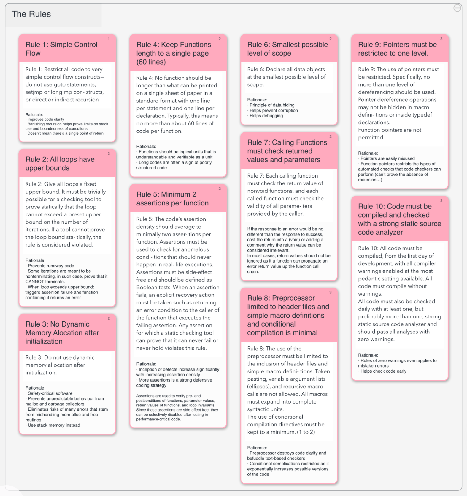

# Software Development Process

## [Software Development Process](https://en.wikipedia.org/wiki/Software_development_process)

### Ways to divide software development into phases

Sticking to a process aims to improve design, product management and project management. Many methodologies rely on having their own definition of deliverables and artifacts that are to be created by the team using the process.

Most modern processes are "agile" and other methodologies are waterfall (linear framework), prototyping (iterative framework), iterative and incremental development (combined linear-iterative framework), spiral development (idem), rapid application development (iterative framework), and extreme programming.

## [Scrum Methodology](https://www.mountaingoatsoftware.com/agile/scrum)

### An agile way to manage software development

Scrum leaves it up to the development team to figure how best to proceed and solve the problems they are presented. It is based on desired outcome and timeboxes called sprints. The whole team is engaged in the organization of tasks and task assignments. Artifacts generated from Scrum development are the product itself, the product backlog - functionalties to be added to the product, and burndown charts.

## [Waterfall Model](https://en.wikipedia.org/wiki/Waterfall_model)

### A Sequential design approach of engineering design

>In Royce's original waterfall model, there are these 6 following phases:
>
>* System and software requirements
>* Analysis
>* Design
>* Coding
>* Testing
>* Operations

Requirements are outlined in product requirements documents. They are then analysed to produce models, schema and business rules. These would form a framework for the software architecture. The coding phase is where development and integration happens. Finally, testing and operations go hand in hand, with the debugging of defects and the maintenance, installation of completed systems.

## [Iterative and Incremental Development](https://en.wikipedia.org/wiki/Iterative_and_incremental_development)

### Created in response to inefficiencies and problems with the waterfall model

* Incremental Iterative development in cycles
* Learning during development of ealier parts or versions of the system
* Initialization step, the iteration step and the Project Control List.
* Differs from Waterfall model. User involvement only in requirements part in Waterfall model, but in Incremental, client is involved at every stage. Product is delivered to the user and only after go from user can they continue.

## [Spiral Model](https://en.wikipedia.org/wiki/Spiral_model)

### A risk-driven software development process model

#### The Six Invariants

* Define Artifacts concurrently
* Perform four basic activities in every cycle
	* Consider win conditions of all success-critical stakeholders
	* Identify and evaluate alternative approaches for satisfying the win conditions
	* Identify and resolve risks that stem for the selected approaches
	* Obtain approval from all success-critical stakeholders, plus commitment to pursue the next cycle
* Risk determines level of effort
	* Project team must determine how much effort is enough
	* Testing should be performed until the total risk is minimized, and no further
* Risk determines degree of details
	* Project team must determine how much detail is enough
	* Precise specifications can reduce or increase risks depending on features
* Use anchor point milestones
	* Life Cycle Objectives
	* Life Cycle Architecture
	* Initial Operational Capabilitiy
* Focus on the system and its life cycle
	* Highlights importance of the overall system and the long-term concerns spanning its entire life cycle

## [Software Documentation types](https://www.altexsoft.com/blog/business/software-documentation-types-and-best-practices/)

### A list of types of documentation

## [Avionics software process](https://en.wikipedia.org/wiki/Avionics_software)

### Rigorous development process

* Development process is required by law and is optimized for safety. Eliminating mistakes is priority.
* Based on outputs called verified "deliverables". Waterfall model.
* Human interfaces, Hazard analysis, Maintenance manual, Design and specification documents, Code production and review (Static code analysis), Unit testing, Integration testing, Black box and acceptance testing and Certification.

## [OMG's Space Industry page](https://www.omg.org/industries/space.htm)

### Standards-based requirements are the future of space technology

* Space Domain Task Force
* Ground Equipment Monitoring Service
* XTCE Telemetry and Command Exchange
* XTCE US Gov Satellite Conformance Profile
* Spacecraft Operations Language Metamodel
* *UML*
	* Designing software applications before coding. Helps specify, visualize and document models of software systems, including their structure and design, in a way that lets architect work at a higher level of abstraction and focus on the big picture.
* Data Distribution Service

## [Best Coding Practices](https://en.wikipedia.org/wiki/Best_coding_practices)

### Set of informal rules to improve quality of software

#### Why?

##### Ninety-ninety rule

Tom Cargill says: "The first 90% of the code accounts for the first 90% of the development time. The remaining 10% of the code accounts for the other 90% of the development time."

#### So there is need of guidance

To prevent exceeding timetables, we stick to informal rules that allow to improve software.

#### Defining Software Quality

>According to Sommerville, software can be generalised into these attributes to qualify its quality:
>* Maintainability
>* Dependability
>* Efficiency
>* Usability

>Weinberg has these four targets when it comes to good programming:
>* Does a program meet its specifications
>* Is the program produced on schedule (and within budget)?
>* How adaptable is the program to cope with changing requirements?
>* Is the program efficient enough for the environment in which it is used?

>Hoare has these seventeen objectives to meet for good programs:
>* Clear definition of purpose
>* Simplicity of use
>* Ruggedness
>* Early availability
>* Reliability
>* Extensibility in the light of experience
>* Brevity
>* Efficiency
>* Minimum cost to develop
>* Conformity to any relevant standards
>* Clear, accurate, and precise user documents 

## [Power of 10](https://web.cecs.pdx.edu/~kimchris/cs201/handouts/The%20Power%20of%2010%20-%20Rules%20for%20Developing%20Safety%20Critical%20Code.pdf)

## Measurably improve software reliability and verifiability

The Power of 10 consists of 10 verifiable, strict and clear set of coding rules that assists in the analysis of critical software components for properties. By following the rules, runaway programs, problems relating to pointers and the dynamic allocation of memory are eliminated.

***

# CubeSat

## [CubeSat Wiki](https://en.wikipedia.org/wiki/CubeSat)

### A miniaturized satellite for space research

* 10x10x10 cubes and made of aluminum alloy.
* History: 1999, and first launched in 2003. Simplified microsatellite development.
* Launcher-payload encapsulation
* When in very LEO (low Earth orbits), radiation can be ignored. Chance of SEU (single event upset) is low.
* Handles task in parallel, attitude control, power management, payload operation, and primary control tasks.
* Mindful of tumbling. Have to detumble. Use reaction wheels (imparting moments), thrusters (imparting couples) or magnetorquers (imparting turning moment) with use of star trackers, Sun sensors, Earth sensors, *angular rate sensors* or electronic gyroscope, and GPS receivers and antennas.
* Location can be determined using on-board GPS which can be costy or relaying radar tracking data from Mission Control
* Propulsion helps slow orbital decay. Propulsion choice are all double-edged.
* Power: Needs battery controlled by a dedicated electrical power system (EPS). Pointing solar arrays.
* Telecom uses VHF, UHF, L-, S-, C- and X-band. Spring loaded antennas.

## [Cubesat Space Protocol](https://en.wikipedia.org/wiki/Cubesat_Space_Protocol)

### A network-layer delivery protocol

* Written in C and ported to run on FreeRTOS and POSIX and pthreads-based OS like Linux
* TCP/IP like

## [Architecture-based Design: A Satellite On-Baord Software Case Study](https://www-verimag.imag.fr/~sifakis/papers_pdfs/Architecture-based%20DesignRep.pdf)

### Architecture styles

* Mutual exclusion style
* Client-server style
* Action flow style
* Action flow with abort style
* Failure monitoring style
* Mode management style
* Buffer management style
* Event monitoring style

## Flight Software Framework for Satellites

* [Intrepid System]
* [KUBOS](https://www.kubos.com/)
* RTOS
	* [FreeRTOS](https://www.freertos.org/)
	* [RTLinux](https://en.wikipedia.org/wiki/RTLinux)
	* [eCos](https://www.ecoscentric.com/ecos/)
	* [RODOS](https://en.wikipedia.org/wiki/Rodos_%28operating_system%29)
	* [Salvo](http://pumpkininc.com/)
* 

### Other things to take into consideration

* Might want threads and similar protection against bit flip
* Keep default build or gold build (never updated) of the previous version as default boot in the event of a reset
* Or, 3 layers of software: bootloader, loads second layer that allows communication to satellite and then loads third layer which contains useful code, which can be updated

